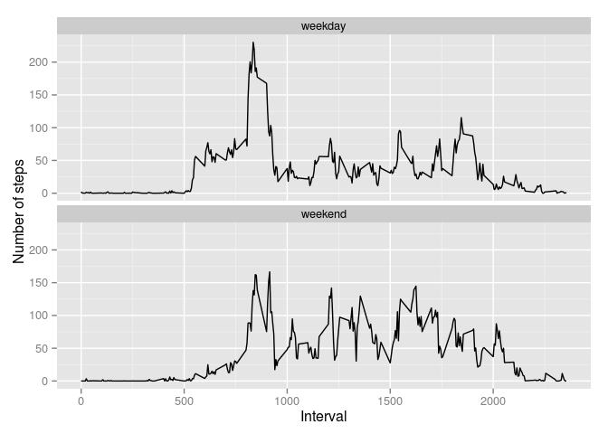

# Reproducible Research: Peer Assessment 1


## Loading and preprocessing the data

```r
raw.data <- read.csv(file = "activity.csv")
```

##Histogram of the total number of steps taken each day

```r
library(dplyr)
by.day <- group_by(raw.data, date)
day.summary <- by.day %>% summarise(total = sum(steps,na.rm = T))
hist(day.summary$total, xlab = "Number of steps", main = "Total number of steps taken each day")
```

 

## Mean and median total number of steps taken per day

```r
mean(day.summary$total)
```

```
## [1] 9354.23
```

```r
median(day.summary$total)
```

```
## [1] 10395
```

## What is the average daily activity pattern?
###Time series plot:

```r
by.interval <- group_by(raw.data, interval)
interval.summary <- by.interval %>% summarise(mean = mean(steps, na.rm = T))
plot(x = interval.summary$interval, y = interval.summary$mean,type = "l", xlab = "Interval", ylab = "Average steps")
```

 

###Which 5-minute interval, on average across all the days in the dataset, contains the maximum number of steps?

```r
interval.summary$interval[which.max(interval.summary$mean)]
```

```
## [1] 835
```

## Imputing missing values
### Total number of missing values in the dataset

```r
sum(is.na(raw.data$steps))
```

```
## [1] 2304
```
### Strategy for filling in all of the missing values in the dataset
Missing step data will be filled using same 5-minute interval

```r
imputed.data <- merge(x = raw.data, y = interval.summary, by = "interval")
imputed.data <- mutate(imputed.data, steps = ifelse(is.na(steps), mean, steps)) %>% arrange(date)
imputed.data <- imputed.data[, c("interval","steps","date")]
```
#### Historgram of the total number of steps taken each day after imputing data

```r
imputed.by.day <- group_by(imputed.data, date)
imputed.day.summary <- imputed.by.day %>% summarise(total = sum(steps))
hist(imputed.day.summary$total, xlab = "Number of steps", main = "Total number of steps taken each day")
```

 

#### Mean and median total number of steps taken per day after imputing data

```r
mean(imputed.day.summary$total)
```

```
## [1] 10766.19
```

```r
median(imputed.day.summary$total)
```

```
## [1] 10766.19
```
From the histogram, mean and median values,  the impact of imputing missing data on the estimates of the total daily number of steps is that the number is increased by around 14%

## Are there differences in activity patterns between weekdays and weekends?
### Adding the "weekend","weekday" classification:
Assuming weekend days are Saturday and Sunday

```r
imputed.data <- mutate(imputed.data, day.type = ifelse(weekdays(as.POSIXct(date)) %in% c("Saturday", "Sunday"), "weekend","weekday"))
imputed.data$day.type <- as.factor(imputed.data$day.type)
```

### Plot of the average number of steps taken, averaged across all weekday days or weekend days 

```r
library(ggplot2)
imputed.by.interval <- group_by(imputed.data, interval, day.type)
imputed.interval.summary <- imputed.by.interval %>% summarise(mean = mean(steps))
qplot(x = interval, y = mean, data = imputed.interval.summary, geom = "line", xlab="Interval", ylab="Number of steps") + facet_wrap(~day.type,ncol=1)
```

 
